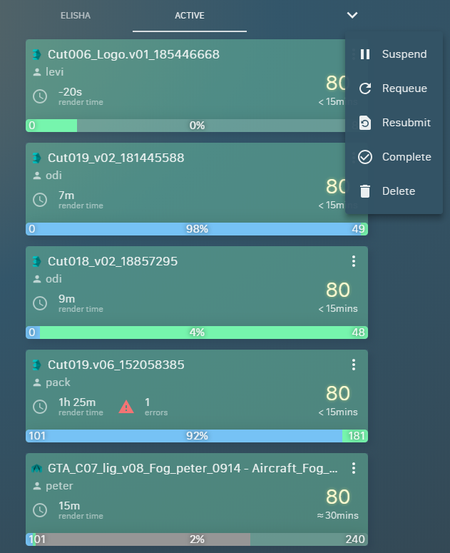

# Deadline Web Manager




設定檔：
```javascript
// src/config/serverURL.js

const corsProxy = 'https://cors_proxy_url/';
const deadlineServer = 'http://deadline_webservice_ip/';

const severURL = corsProxy + deadlineServer;

export default severURL;
```